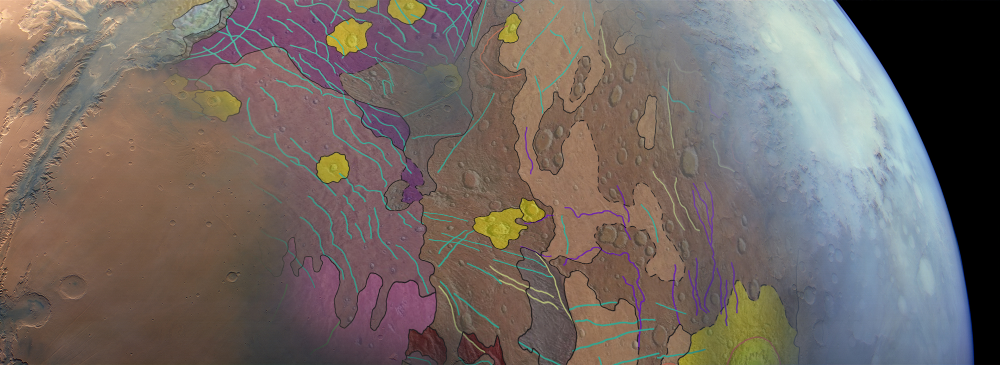

# GMAP Winter School 2023

# GMAP Data publication

In this session we are going to see how to publish a planetary data package on a platform like Zenodo. There is a discussion about the metadata relevant for describing planetary data and how to present them to the user through general-purpose data management systems.

After presenting GMAP Data Portal, I will present the metadata model we use to describe our data packages (_i.e._, maps), and _teach_ you how to use such software; Either through the graphical user interface, as well as programmatically.
GMAP Data Portal is an instance of InvenioRDM, the open-source software behind Zenodo, running on our premises, https://data.europlanet-gmap.eu.

### Roadmap

- What is Zenodo, and why do we need it?
- GMAP Data Portal
- What are metadata for planetary data?
- Access data from Zenodo
- Access data from ADAM

## Zenodo

The general definition of Zenodo (https://zenodo.org) is: a platform for digital resources publication. Resources can be data, articles, software, or any other digital media. Zenodo is primarily meant to store scientific research products, though there no restrictions about the type, structure, or number of files associated to each publication. Zenodo is _not_ the only _research data management_ (RDM) platform (as this kind of software is called), but probably the best known (in Europe).

Other RDM software are Harvard's Dataverse (https://data.harvard.edu/), Figshare (https://figshare.com/), Open Source Framework (https://osf.io), CKAN (https://ckan.org/), and InvenioRDM (https://inveniordm.docs.cern.ch/).

InvenioRDM was recently launch and is developing fast. It is a spin-off from Zenodo, the _open-source_ version of Zenodo, I'd say, that can be installed on your very own premises.

### GMAP & InvenioRDM

At GMAP, we host an instance of InvenioRDM that you can reach at https://data.europlanet-gmap.eu, where we make experiments about planetary data publication. These experiments go both ways: on one hand we model our data and metadata to conform a general purpose RDM system such as Invenio or Zenodo (and, really, all of the systems out there).

In the GMAP Data Portal, we publish the data packages produced by the project -- _i.e._, the geological maps --, as well as data publications from partner projects such as Astropedia (https://astrogeology.usgs.gov/astropedia).

## Planetary metadata

A very important component of _data_, especially when we are talking about sharing, is the _metadata_ associated to it. Metadata is all the information associated to a piece of data or dataset that gives _meaning_ to it. Metadata describes the content and the context of that data; It is through metadata that search engines do their magic.

Scientific data have very peculiar and diverse metadata sets: we collect very precise data about everything. And depending on your scientific area of interest or type of data you are looking for the attributes of your data _search_ will vary accordingly, from vague "topic of interest" keywords to precise "image resolution" ratios. Consequently, whoever publishes scientific datasets must think through the necessary information to present -- so that the data can be easily found --, as well as _how_ to present all that information.

### Data Model

In discussions on the matter (data & metadata), the term _Data Model_ is frequently used: it means the set of attributes and the structure used to represent a data product or dataset.
For instance, GMAP defined a (meta) _data model_ for presenting the project's data packages (geological maps).

The set of metadata attributes defined by the GMAP project to describe a geological map is published in the project's wiki page https://wiki.europlanet-gmap.eu/bin/view/Main/Documentation/Map-wide%20metadata/ . Such data model is based on GMAP's parent project PLANMAP (https://planmap.eu/) and the well-known, long-running service Astropedia by USGS.

Although the data model designed by GMAP is complete and exhaustive in the description of geological maps, we face issues when publishing the packages in general-purpose data management platforms such as Zenodo and InvenioRDM, for instance: those system's metadata model do not exactly match the particular demands for planetary geological maps. And so, adjustments must be applied to the attributes structure of GMAP model.

To understand better the adjustments being applied between the data models have a look at the document https://github.com/europlanet-gmap/invenio-tools/blob/main/metadata.md . There we discuss the current issues being faced by the data models -- GMAP _vs_ Invenio/Zenodo -- and possible modifications for a future version.

## How/What to publish

In practical terms, of interest for the participants of this school, when publishing your data packages and geological maps in Zenodo/Invenio, for instance, you want to fill-in the following attributes:

| Invenio/Zenodo Attribute | Description |
| - | - |
| Title | Title of map/package |
| Creators | Author names |
| Description | Long description:  summary of data package contents Target body CRS Bounding-box as a bullet-list |
| Additional descriptions | Short description of each file uploaded (if any) |
| Alternate identifiers | DOI of companion paper, if any |
| Funding references | Acknowledgements to scholarships/funding projects |
| Publication_date | Publication date (eg, today) | 
| Publisher | Your institutions or "GMAP" | 
| Related identifiers | Data used Link to other data Related products |
| Resource type | Type of data product, `dataset` if in doubt | 
| Rights/Licenses | If in doubt, "Creative Commons" |

For the files composing the package:
- PDF documents and JPG/PNG images: upload individually;
- Scientific data (Raster and Vector data files): _zip_ them all, upload the ZIP file.

> **Note:** File sizes are usually an issue as such platforms are not designed for the datasets planetary scientist are used to (~Gigabytes), if the goal is to publish the whole set of data used in the production of a map. In those cases, reduce the size of the raster/image files to a reasonable size (~Megabytes) before _zipping_ and uploading.

### Zenodo Sandbox

Zenodo provides a _sandbox_ version of the site at https://sandbox.zenodo.org, where we can test the publication of packages as much as we want. The packages published there are temporary, will eventually be deleted so we don't have to worry about wasting resources with tests and trials nor do we have to worry about an "ugly" publication after our name. 

After trying and testing the right format and content of a package in Zenodo-Sandbox, you can then move to the _production_ Zenodo (https://zenodo.org) and have your package properly published for good.

## Examples on accessing data

Sometimes we want to access data in a programatic way, using Python for example. You may want to do so because you _mining_ many data resources, or because you want to create a reproducible workflow. Regardless the reason, Zenodo provides a fully-featured REST API for searching and accessing data records and their data content.

### Zenodo
In the notebook [`notebooks/download_data_from_zenodo_record.ipynb`](notebooks/download_data_from_zenodo_record.ipynb) there is a workflow exemplifying the programatic access of the Mars Craters dataset by Chiara Marmo and Anthony Lagain (2020), https://zenodo.org/record/3633594.

In the notebook, we use the [Zenodo-Client](https://pypi.org/project/zenodo-client) Python library to access the record, go through the metadata associated to the record, and download one specific file (Mars craters) of our interest. Then, we explore the content of the craters table, transform the coordinates to a CRS compatible to basemap for the eventual visualization:

### ADAM

The basemap used in the image above (the Zenodo/Mars craters example) was downloaded from the ADAM platform, https://explorer-space.adamplatform.eu, the ADAM Space-Explorer app. The Space-Explorer was developed as part of the NEANIAS project, https://www.neanias.eu/, partner of GMAP through the Constructor University (former Jacobs University).

ADAM Space-Explorer provides an interactive interface for the exploration of Martian datasets originally sourced from USGS Planetary Data System (PDS), https://ode.rsl.wustl.edu/. The data products provided by ADAM are fully calibrated (GeoTIFF) Martian images from the MRO/CTX and HiRISE experiments.

In the notebook [`notebooks/search_and_download_data_product_from_adam.ipynb`](notebooks/search_and_download_data_product_from_adam.ipynb) we show how to search and download CTX images based on geographical information (bounding-box) through [ADAM API](https://pypi.org/project/adamapi/) (also a Python library).

### NPT

Behind ADAM Space-Explorer, at the core of the Data Processing System, there is the NEANIAS Planetary Tools Python library (NPT), https://pypi.org/project/npt/. NPT is the software responsible processing the planetary data products downloaded from USGS/PDS and being published by ADAM.

With NPT you can recreate the same data products (ie, images) available on ADAM, but also access and reduce other datasets such as MEX/HRSC. You will also find tools for creating images mosaics, directly search USGS/PDS archives, and interacting with USGS/ISIS tools.

For examples on using NPT, see its notebooks directory at Github: https://github.com/chbrandt/npt .
