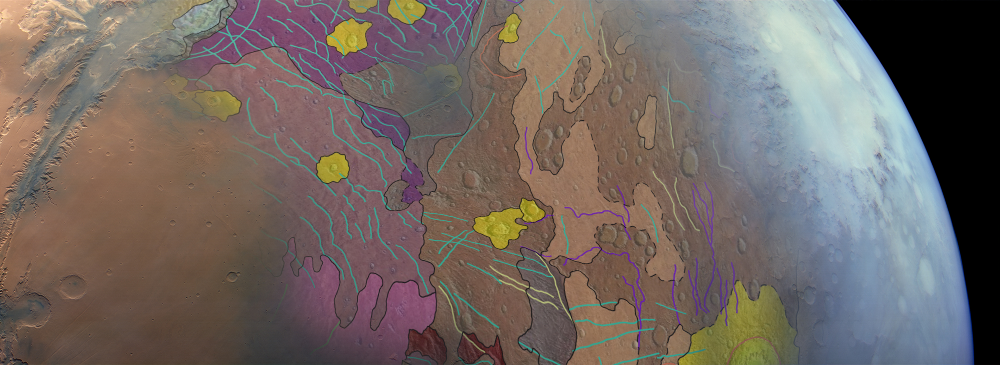

# GMAP Winter School 2023

# GMAP Jupyter environment

In this session I'll present the JupyterLab environment we have setup for the GMAP community and how _any_ planetary data scientist can benefit from that.

After showing the GMAP JupyterHub we have running on our premises, https://jupyter.europlanet-gmap.eu, I will _teach_ you how to have the same environment running on your own computer. 
There are many components/concepts to catch-up in this session, and things may get a bit overwelming.
Don't worry, stay with me, take notes, note your questions; If not already by the end of the session, by the end of the day you will have a fully working planetary data science environment and a bunch of new software concepts in at your portfolio ;)

### Roadmap

- What is Jupyter (Notebook, Lab, Hub), and why do we need it?
- What is a planetary data science (software) environment?
  * Python
  * GDAL
  * ISIS, ASP
- GMAP'JupyterHub @ GMAP
- GMAP'JupyterHub @ _you_

## Jupyter (Notebook, Lab, Hub)

- **Jupyter _Notebook_** is (or _was) a software that runs on your web-browser and allows for the creation of _notebooks like this one_: documents where we can mix (Python) code, the output of such code, and text and multimedia content all together.
- Years went by, Jupyter _Notebook_ evolved into a better interface: **Jupyter _Lab_** (or Jupyter-Lab, or JupyterLab); The fundamental functionality is the same: provision of a feature-rich interface around _notebooks_ to document and run interactively (Python) code.
- Finally, **Jupyter _Hub_** (Jupyter-Hub, JupyterHub) is a manager for multiple _Notebook_ or _Lab_ instances. It is used in a multi-user and distributed computing environment to control access and launch Jupyter-* instances.

> Image of Jupyter Notebook, Jupyter Lab interfaces.

For more information and details about the Jupyter project, visit https://jupyter.org/.

## Planetary data science environment

When we talk about a _data science environment_ -- in the context of software -- we are referring to a set of software tools and libraries necessary to proceed with the data analysis tasks at hand.
In our case, the _tasks at hand_ correspond to processing, visualization, and management of planetary, georeferenced data.

For instance, QGIS provides a whole environment for georeferenced data analysis; It is provides such environment through a _graphical interface_ and can be extended through Python plugins.

In our case, though, the _data science environment_ we talking about is one step lower, at the command-line and/or Python code; Complementary to QGIS for whenever we need more control over the processing or -- effectively -- specific tools that go beyond georeferenced data: _planetary data_.

The environment for planetary data we setup is composed by the following software:

- GDAL: https://gdal.org/
- ISIS: https://isis.astrogeology.usgs.gov/7.0.0/index.html
- ASP: https://stereopipeline.readthedocs.io/en/latest/
- Python GIS libraries

Such environment combine the tradicional software used by the community (GDAL, ISIS, ASP) with the new modern software stack mostly composed by Python data science libraries (GeoPandas, Shapely, Rasterio, etc).

## GMAP JupyterHub

### Deploy it yourself

You can run the ISIS/ASP Jupyter containers if you want to have the same working environment on your computer; Or even the whole JupyterHub platform!
In the repository https://github.com/europlanet-gmap/docker-isis3 you will find all the instruction to create and deploy the hub on your premises.

If you are looking for the container images only (recommended), see the `standalone` branch of `europlanet-gmap/docker-isis3` repository or checkout the images directly from DockerHub:
- https://github.com/europlanet-gmap/docker-isis3/tree/standalone
- https://hub.docker.com/r/hyradus/isis-asp3-gispy
