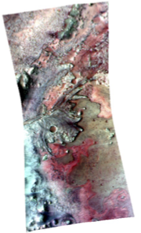
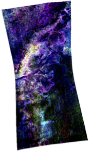
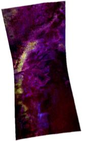
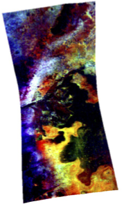

# 2023 GMAP Winter School - Mars data sources

- [2023 GMAP Winter School - Mars data sources](#2023-gmap-winter-school---mars-data-sources)
  * [CTX regional context (Caltech Murray Lab)](#ctx-regional-context--caltech-murray-lab-)
    + [Access URL](#access-url)
    + [Citation](#citation)
    + [Filename(s)](#filename-s-)
    + [CRS](#crs)
  * [Mars 2020 Science Investigation CTX DEM Mosaic (USGS Astropedia)](#mars-2020-science-investigation-ctx-dem-mosaic--usgs-astropedia-)
    + [Access URL](#access-url-1)
    + [Citation](#citation-1)
    + [Filename(s)](#filename-s--1)
    + [CRS](#crs-1)
  * [Mars 2020 Terrain Relative Navigation Context Camera Orthorectified Image Mosaic](#mars-2020-terrain-relative-navigation-context-camera-orthorectified-image-mosaic)
    + [Access URL](#access-url-2)
    + [Citation](#citation-2)
    + [Filename(s)](#filename-s--2)
    + [CRS](#crs-2)
  * [Mars 2020 Terrain Relative Navigation HiRISE DTM Mosaic](#mars-2020-terrain-relative-navigation-hirise-dtm-mosaic)
    + [Access URL](#access-url-3)
    + [Citation](#citation-3)
    + [Filename(s)](#filename-s--3)
    + [CRS](#crs-3)
  * [Mars 2020 Terrain Relative Navigation HiRISE Orthorectified Image Mosaic](#mars-2020-terrain-relative-navigation-hirise-orthorectified-image-mosaic)
    + [Access URL](#access-url-4)
    + [Citation](#citation-4)
    + [Filename(s)](#filename-s--4)
    + [CRS](#crs-4)
  * [CRISM](#crism)
    + [Access URL](#access-url-5)
    + [Citation](#citation-5)
    + [Filename(s)](#filename-s--5)
    + [CRS](#crs-5)
  * [CASSIS](#cassis)
    + [Access URL](#access-url-6)
    + [Citation](#citation-6)
    + [Filename(s)](#filename-s--6)
    + [CRS](#crs-6)
- [References](#references)


Data sources are indicated below, together with relevant publications and Coordinate Reference Systems (CRS) of data as provided for the Winter School, provided as [pro4](https://proj.org) (Proj contributors, 2020) string. Please note the original CRS might differ. See also the latest developments on OGC IAU codes (e.g. Hare and Malapert, 2021).

The CRS of the GIS project for the Winter school is, in proj4:

```'+proj=eqc +lat_ts=0 +lat_0=0 +lon_0=0 +x_0=0 +y_0=0 +R=3396190 +units=m +no_defs'```

or, using the OGC/IAU newer codes:

```IAU_2015:49910```

see also:  

* https://www.hou.usra.edu/meetings/planetdata2021/pdf/7012.pdf
* http://voparis-vespa-crs.obspm.fr:8080/ws/IAU/2015/49910
* http://voparis-vespa-crs.obspm.fr:8080/web/mars.html

## CTX regional context (Caltech Murray Lab)

The mosaic has been subsampled to 20m. It  is included to provide geomorphologic context to the area.

### Access URL 

http://murray-lab.caltech.edu/CTX/ 

### Citation

Dickson, J. L., Kerber, L. A., Fassett, C. I., & Ehlmann, B. L. (2018). A global, blended CTX mosaic of Mars with vectorized seam mapping: A new mosaicking pipeline using principles of non-destructive image editing. In Lunar and planetary science conference (Vol. 49, #2083. The Woodlands, TX, USA: Lunar and Planetary Institute.

### Filename(s)

CTX-mosaic_E76_N16_eqc_20m.tif (170 Mb, originally not subsampled 2.7 Gb)

### CRS

```'+proj=eqc +lat_ts=0 +lat_0=0 +lon_0=0 +x_0=0 +y_0=0 +R=3396190 +units=m +no_defs'``` 

(see also http://voparis-vespa-crs.obspm.fr:8080/ws/IAU/2015/49910)

--- 

## Mars 2020 Science Investigation CTX DEM Mosaic (USGS Astropedia)

### Access URL

https://astrogeology.usgs.gov/search/map/Mars/Mars2020/Jez_MARS2020_CTX_DEM_Science_Mosaic

### Citation

Mangold et al., 2021, Perseverance rover reveals an ancient delta-lake system and flood deposits at Jezero crater, Mars, Science. https://doi.org/10.1126/science.abl4051

Beyer, R. A, O. Alexandrov, S. McMichael, et al. 2020, NeoGeographyToolkit/StereoPipeline 2.7.0, Zenodo, https://doi.org/10.5281/zenodo.3963341.

Fergason, R. L., Hare, T. M., Mayer, D. P., Galuszka, D. M., Redding, B. L., Smith, E. D., Shinaman, J. R., Cheng, Y., Otero, R. E., 2020, Mars 2020 Terrain Relative Navigation Flight Product Generation: Digital Terrain Model and Orthorectified Image Mosaics, 51st Lunar and Planetary Science Conference, URL: https://doi.org/10.5066/P906QQT8, or abstract.

Malin, M.C. et al., 2007, Context Camera Investigation on board the Mars Reconnaissance Orbiter, J. Geophys. Res. 112, E05S04, doi:10.1029/2006JE002808, URL: https://doi.org/10.1029/2006JE002808

### Filename(s)

M20_JezeroCrater_CTXDEM_20m.tif (87 Mb)

### CRS

```'+proj=eqc +lat_ts=0 +lat_0=0 +lon_0=0 +x_0=0 +y_0=0 +R=3396190 +units=m +no_defs'```

## Mars 2020 Terrain Relative Navigation Context Camera Orthorectified Image Mosaic

### Access URL 

https://astrogeology.usgs.gov/search/map/Mars/Mars2020/JEZ_ctx_B_soc_008_orthoMosaic_6m_Eqc_latTs0_lon0

### Citation

Fergason, R. L., Hare, T. M., Mayer, D. P., Galuszka, D. M., Redding, B. L., Smith, E. D., Shinaman, J. R., Cheng, Y., Otero, R. E., 2020, Mars 2020 Terrain Relative Navigation Flight Product Generation: Digital Terrain Model and Orthorectified Image Mosaics, 51st Lunar and Planetary Science Conference, URL: https://www.hou.usra.edu/meetings/lpsc2020/pdf/2020.pdf.

Malin, M.C. et al., 2007, Context Camera Investigation on board the Mars Reconnaissance Orbiter, J. Geophys. Res. 112, E05S04, doi:10.1029/2006JE002808, URL: https://agupubs.onlinelibrary.wiley.com/doi/full/10.1029/2006JE002808%4010.1002/%28ISSN%292169-9100.MARSROM1

DOI Link: https://doi.org/10.5066/P9GV1ND3

### Filename(s)

JEZ_ctx_B_soc_008_orthoMosaic_6m_Eqc_latTs0_lon0.tif (35 Mb)

### CRS

```'+proj=eqc +lat_ts=0 +lat_0=0 +lon_0=0 +x_0=0 +y_0=0 +R=3396190 +units=m +no_defs'```

--- 

## Mars 2020 Terrain Relative Navigation HiRISE DTM Mosaic

### Access URL 

https://astrogeology.usgs.gov/search/map/Mars/Mars2020/JEZ_hirise_soc_006_DTM_MOLAtopography_DeltaGeoid_1m_Eqc_latTs0_lon0_blend40

### Citation

Fergason, R. L., Hare, T. M., Mayer, D. P., Galuszka, D. M., Redding, B. L., Smith, E. D., Shinaman, J. R., Cheng, Y., Otero, R. E., 2020, Mars 2020 Terrain Relative Navigation Flight Product Generation: Digital Terrain Model and Orthorectified Image Mosaics, 51st Lunar and Planetary Science Conference, URL: https://www.hou.usra.edu/meetings/lpsc2020/pdf/2020.pdf.

McEwen, A.S. et al., 2007, Mars Reconnaissance Orbiter's High Resolution Imaging Science Experiment (HiRISE), J. Geophys. Res. 112, E05S04, URL: https://doi.org/10.1029/2005JE002605

### Filename(s)

JEZ_hirise_soc_006_DTM_MOLAtopography_DeltaGeoid_1m_Eqc_latTs0_lon0_blend40.tif (1.8 Gb)

### CRS

```'+proj=eqc +lat_ts=0 +lat_0=0 +lon_0=0 +x_0=0 +y_0=0 +R=3396190 +units=m +no_defs'```

--- 


## Mars 2020 Terrain Relative Navigation HiRISE Orthorectified Image Mosaic

### Access URL 

https://astrogeology.usgs.gov/search/map/Mars/Mars2020/JEZ_hirise_soc_006_orthoMosaic_25cm_Eqc_latTs0_lon0_first


### Citation

Fergason, R. L., Hare, T. M., Mayer, D. P., Galuszka, D. M., Redding, B. L., Smith, E. D., Shinaman, J. R., Cheng, Y., Otero, R. E., 2020, Mars 2020 Terrain Relative Navigation Flight Product Generation: Digital Terrain Model and Orthorectified Image Mosaics, 51st Lunar and Planetary Science Conference, URL: https://www.hou.usra.edu/meetings/lpsc2020/pdf/2020.pdf.

McEwen, A.S. et al., 2007, Mars Reconnaissance Orbiter's High Resolution Imaging Science Experiment (HiRISE), J. Geophys. Res. 112, E05S04, URL: https://doi.org/10.1029/2005JE002605

### Filename(s)

JEZ_hirise_soc_006_orthoMosaic_25cm_Eqc_latTs0_lon0_first (7.4 Gb)

### CRS

```'+proj=eqc +lat_ts=0 +lat_0=0 +lon_0=0 +x_0=0 +y_0=0 +R=3396190 +units=m +no_defs'```

--- 


## CRISM

CRISM browse products are RGB maps which help to easily assess the distribution of a certain kind of mineralogy in the scene. Find below the description of each browse product you will find in the hands-on exercise (HRL000040FF CRISM cube is used as an example):

**False colour infrared browse product (FAL):** 

This is an enhanced infrared false colour representation of the scene, and it is meant to highlight different mineral groups. The chosen wavelengths are:

* R = R2529 (reflectance at 2529 nm)
* G = R1506 (reflectance at 1506 nm)
* B = R1080 (reflectance at 1080 nm)



Red/orange colours indicate olivine-rich material. Blue/green indicate carbonates and clays. Grey/brown colours indicate basaltic material.

**Mafic browse product (MAF):**

This RGB composite shows information related to the mafic mineralogy in the scene.
The chosen spectral parameters are:

* R = OLINDEX3
* G = LCPINDEX2
* B = HCPINDEX2


Red is for olivine-rich materials, although Fe-phyllosilicates can be highlighted as well. Green/cyan indicates low-calcium pyroxenes. Blue/magenta indicates high-calcium pyroxenes.

**Phyllosilicate browse product (PHY):**

This RGB composite shows information related to hydroxylated minerals, including phyllosilicates. 
The chosen spectral parameters are:

* R = D2300
* G = D2200
* B = BD1900R2



Fe/Mg-OH bearing minerals (e.g., Fe/Mg phyllosilicates) appear red, or magenta when hydrated. Al/Si-OH bearing minerals (e.g., Al-phyllosilicates or hydrated silica) will appear green, or cyan when hydrated. Blue colours are indicative of other hydrated minerals. Yellow/whiteish areas are carbonate-rich (see next browse products).

**Carbonates browse product (CAR):**

This RGB composite shows information related to Mg carbonates. 
The chosen parameters are:

* R = D2300
* G = BD2500_2
* BD1900_2



Bright yellow/green/white colours indicate Mg carbonates. Magenta colours indicate Fe/Mg-phyllosilicates. 

**Carbonates (and olivine) custom browse product (from Horgan et al., 2020):**

This RGB composite highlights the variability within the carbonate unit of Jezero crater. 
The chosen spectral parameters are*: 

* R = BD1300
* G = BDI1000IR
* B = MIN_2295_2480



Red is for Olivine-rich areas. Cyan/blue indicates strong carbonate signature but weak olivine. Yellow/white highlights strong carbonate and strong olivine signature. Green is for relatively olivine-poor areas with other Fe-bearing phases (e.g., clays). 

See Viviano, C.E., et al. (2014) for a detailed explanation if you are interested in how spectral parameters are defined.


### Access URL 

https://ode.rsl.wustl.edu/mars/

https://pds-geosciences.wustl.edu/mro/mro-m-crism-5-rdr-mptargeted-v1/mrocr_4001/mtrdr/2007/2007_111/frt00005850/

https://ode.rsl.wustl.edu/mars/pagehelp/Content/Missions_Instruments/Mars%20Reconnaissance%20Orbiter/CRISM/CRISM%20Product%20Primer/CRISM%20MTRDR.htm


### Citation

Viviano, C. E., et al. (2014), Revised CRISM spectral parameters and summary products based on the currently detected mineral diversity on Mars, J. Geophys. Res. Planets, 119, 1403– 1431, doi:10.1002/2014JE004627.

Horgan B. H., et al. (2020), The mineral diversity of Jezero crater: Evidence for possible lacustrine carbonates on Mars, Icarus, 339, doi:10.1016/j.icarus.2019.113526. 

Brown, A. J., Viviano, C. E., & Goudge, T. A. (2020). Olivine-Carbonate Mineralogy of the Jezero Crater Region. Journal of Geophysical Research: Planets, 125, e2019JE006011. https://doi.org/10.1029/2019JE006011

Seelos, K. D., et al. (2019), “The MICA Files: A Compilation and Reference Document for Minerals Identified Through CRISM Analysis”, 50th Lunar and Planetary Science Conference contribution no. 2132. 

Link to the MICA files web page: http://crism.jhuapl.edu/data/mica/


### Filename(s)

### CRS

```'+proj=eqc +lat_ts=0 +lat_0=0 +lon_0=0 +x_0=0 +y_0=0 +R=3396190 +units=m +no_defs'```

(original crs ```'+proj=eqc +lat_ts=0 +lat_0=15 +lon_0=0 +x_0=0 +y_0=0 +R=3394839.81331631 +units=m +no_defs'```)

--- 

## CASSIS

Level 3C products(map projected cubes) available on https://cassis.halimede.unibe.ch/observations

List of images used in moaics (West to East):

```
MY35_010783_165_0
MY36_017709_165_0
MY36_017597_162_3
MY36_016465_161_0
MY36_018020_161_0
MY35_009664_162_0
```

Processing workflow:

- Importing to GIS and registering to CTX Murray Lab mosaic
- Cropping NoData boundaries for mosaicking
- Converting from 32bit float to 8 bit unsigned
- Creating colour band ration composites following Tornabene et al. (2018). Description of CBRC1a on Table 3. 
https://link.springer.com/article/10.1007/s11214-017-0436-7/tables/3
- Adjusting stretching to each composite to colour balance products and exporting with current rendering
- Adding rasters to mosaic and exporting mosaic to TIFF

### Access URL 

https://cassis.halimede.unibe.ch/observations

### Citation

Tornabene, L. L., Seelos, F. P., Pommerol, A., Thomas, N., Caudill, C. M., Becerra, P., ... & Wray, J. J. (2018). 
Image simulation and assessment of the colour and spatial capabilities of the Colour and Stereo Surface Imaging System (CaSSIS) on the ExoMars Trace Gas Orbiter. 
Space science reviews, 214(1), 1-61. doi:10.1007/s11214-017-0436-7

Thomas, N., Cremonese, G., Ziethe, R., Gerber, M., Brändli, M., Bruno, G., ... & Wray, J. J. (2017). 
The colour and stereo surface imaging system (CaSSIS) for the ExoMars trace gas orbiter. 
Space science reviews, 212(3), 1897-1944. doi:10.1007/s11214-017-0421-1

### Filename(s)

MY35_010783_165_0_CRBC1a.tif (130 Mb)

mosaic_A_delta.tif (164 Mb)

mosaic_B_Floor.tif (269 Mb)


### CRS

```'+proj=eqc +lat_ts=0 +lat_0=0 +lon_0=0 +x_0=0 +y_0=0 +R=3396190 +units=m +no_defs'```

--- 

# References

Beyond dataset-specific references, those are relevant:

Cheng, Y., Ansar, A., & Johnson, A. (2021). Making an onboard reference map From MRO/CTX imagery for Mars 2020 lander vision system. Earth and Space Science, 8(8), e2020EA001560.

Hare, T. M., & Malapert, J. C. (2021). Standards Proposal for 2021 to Support Planetary Coordinate Reference Systems for Open Geospatial Web Services. LPI Contributions, 2549, [7012](https://ui.adsabs.harvard.edu/abs/2021LPICo2549.7012H/abstract). 

PROJ contributors (2020). PROJ coordinate transformation software library. Open Source Geospatial Foundation. URL https://proj.org/. DOI: 10.5281/zenodo.5884394


--- 


--- 
